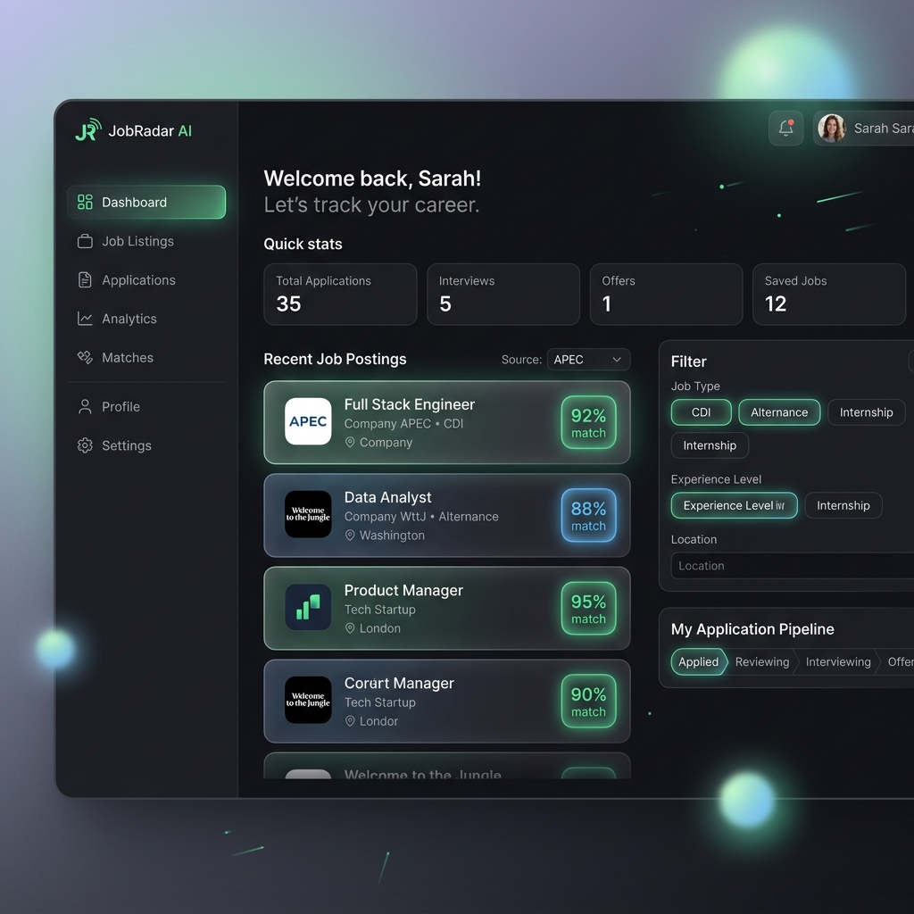

# JobRadar AI — UI/UX Design Specification

This document defines the branding name, visual styling system, and interface layouts for the JobRadar AI dashboard.

---

## 1. Project Name: **JobRadar AI**
We will call the platform **JobRadar AI** (retaining your original pipeline identity, but emphasizing the generative AI/Gemini-powered CV & cover letter features).

---

## 2. Design System & Aesthetics

We will use a premium, modern dark-mode theme featuring glassmorphism elements, subtle glows, and micro-animations to make the interface feel alive and state-of-the-art.

* **Primary Palette**: Deep slate background (`#0d0f12`), dark card backgrounds with translucent borders (`rgba(255, 255, 255, 0.05)`), and vibrant matching-score indicator accents (Emerald Green for high match, Electric Cyan for mid-range, Neon Orange for lower).
* **Typography**: Clean, geometric sans-serif fonts (e.g., **Outfit** or **Inter** from Google Fonts).
* **Transitions**: Smooth `150ms ease-in-out` transitions on card hovers, status drag-and-drops, and drawer slide-outs.

---

## 3. UI Dashboard Mockup

Below is a visual concept of the main Dashboard. It features a structured sidebar, quick stats counters, matching score pills, and interactive filters for CDI vs. Alternance.

---

## 4. Key Page Layouts

### `/` — Dashboard (The Feed)
- **Top Row**: Quick metrics cards (Total Apps, Interviews, Offers, Scraped Today).
- **Left Panel**: Main feed of recently scraped job cards ranked by match score. Each card displays:
  - Job Title, Company, Location.
  - Glowing radial or chip showing the Match Score (e.g., `95% match`).
  - Contract type badge (`CDI` / `Alternance`).
  - Score details on hover (showing Semantic %, TF-IDF %, and Recency % breakdown).
- **Right Panel**: Floating sticky filter controls for matching range, source filtering, and job type (CDI vs. Alternance vs. Internships).

### `/pipeline` — Kanban Board
- **Layout**: 5 columns (*New, Reviewed, Applied, Interviewing, Offer/Rejected*).
- **Cards**: Simplified job cards that can be dragged between columns.
- **Interactions**:
  - Dragging a card triggers a database update status API.
  - Hovering reveals a quick "Generate Materials" icon button.

### `/feats` — The Accomplishments Vault
- **Layout**: Split-screen design.
  - **Left column**: A clean markdown/text area form where you can dump your achievements, metric points, and associate tags (e.g., `#nestjs`, `#postgres`, `#scaling`).
  - **Right column**: A grid of existing feats cards. Each card has a quick copy button and edit options.

### Slide-Out "Apply Assistant" Drawer
- Triggered by clicking "Generate Materials" on any job card.
- Slides out from the right side of the screen using a frosted glass background.
- **Top Bar**: Job details (Title, Company, Stack).
- **Main Section (Tabbed Navigation)**:
  - **Tab 1 (CV Customizer)**: Side-by-side view showing your base CV on the left and the Gemini-tailored CV (incorporating selected accomplishments) on the right.
  - **Tab 2 (Cover Letter)**: A copyable, clean-text layout of the French "Moi, Vous, Nous" formatted cover letter.
  - **Tab 3 (Achievements Selector)**: A checklist of all achievements from your accomplishments vault. You can toggle checkboxes to choose exactly which feats Gemini should use to customize the output, then click "Regenerate".
