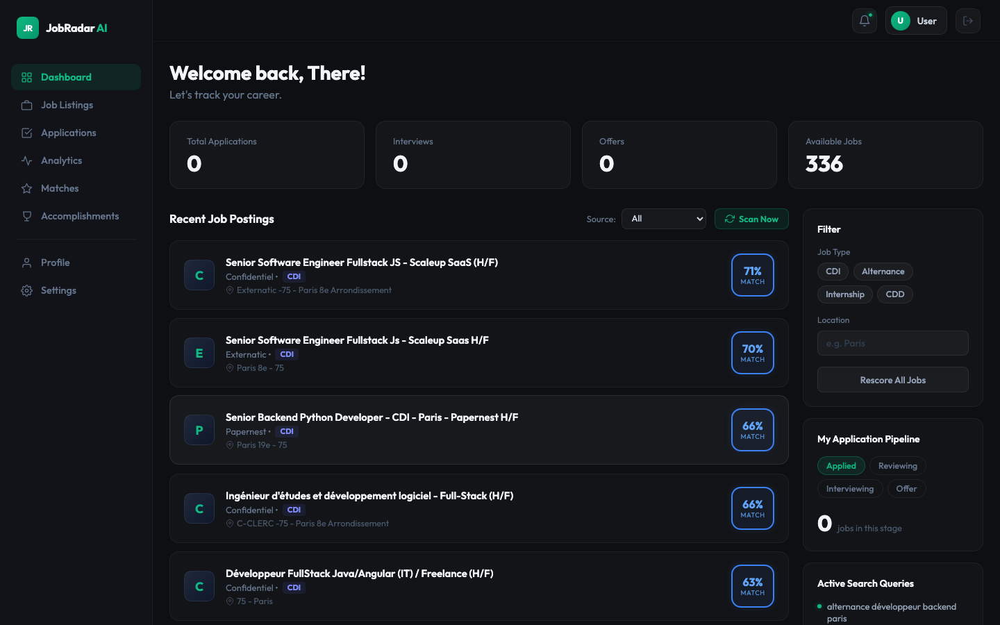
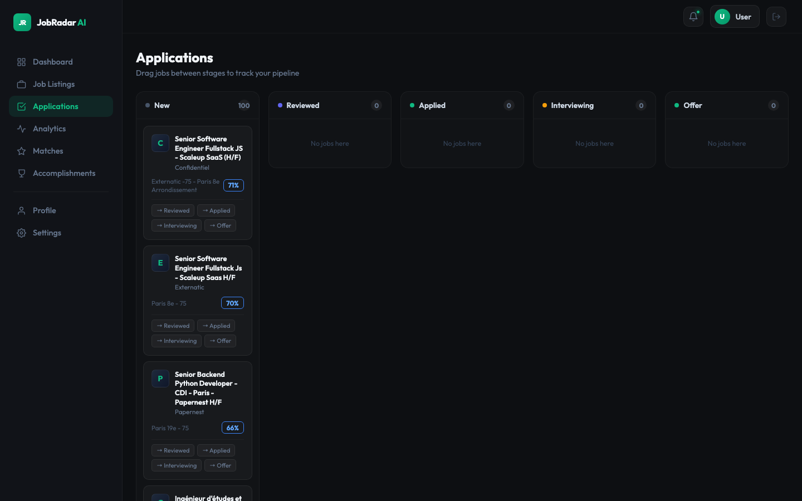
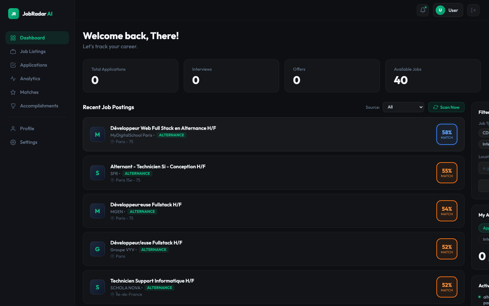

# 🎯 JobRadar AI

[](https://python.org)
[](https://fastapi.tiangolo.com)
[](https://nuxt.com)
[](https://aistudio.google.com)
[](https://neon.tech)
[](https://upstash.com)

**JobRadar AI** is a self-hosted, AI-powered job search and application platform. It automatically scrapes French job boards for **CDI**, **Alternance**, **CDD**, and **Stage** roles, ranks them per user using a **Hybrid Semantic & Keyword Matching Engine**, and leverages Google Gemini to generate tailored CVs and cover letters based on your personal **Accomplishments Vault**.

---

## 📸 Screenshots

<div align="center">
  <h3>1. Dashboard & Job Feed</h3>
  
  
  <h3>2. Kanban Application Pipeline</h3>
  
  
  <h3>3. Alternance Filter</h3>
  
</div>

---

## 📖 Deep-Dive Documentation Index

To keep this README concise, detailed guides are organized into separate files. Click the links below to explore each area:

1. 🏛️ **[System Architecture](file:///Users/stephenakugbe/Documents/nodejs/jobradar/docs/architecture.md)** — Architectural layout, component topologies, ingestion sequence, and backend-worker relations.
2. 🧮 **[Scraping & Scoring Engine](file:///Users/stephenakugbe/Documents/nodejs/jobradar/docs/scraping-and-scoring.md)** — Core details on the five board scrapers (WTTJ, HelloWork, France Travail, LesJeudis, Remotive) and the exact math/weights behind the Hybrid Scoring formula.
3. 🔌 **[API Reference Guide](file:///Users/stephenakugbe/Documents/nodejs/jobradar/docs/api.md)** — Detailed endpoint catalog for authentication, profiles, CV parsing, job retrieval, and AI material generation.
4. ⚙️ **[Development & Setup Guide](file:///Users/stephenakugbe/Documents/nodejs/jobradar/docs/development-and-setup.md)** — Complete step-by-step developer instructions for Docker Compose and bare-metal installations, environment configurations, database seeds, and troubleshooting.

---

## ✨ Features

- **Multi-Source Scraping Engine**: Simultaneously crawls Welcome to the Jungle, HelloWork, France Travail (Pôle Emploi API), LesJeudis, and Remotive with automatic deduplication.
- **Hybrid Multi-User Scoring Engine**:
  - **Semantic Cosine Similarity (45%)** via Google Gemini Embeddings (`text-embedding-004`).
  - **TF-IDF Keyword Relevance Match (40%)** comparing job details with target tech skills.
  - **Recency decay (15%)** to deprioritize older listings.
  - **Location & Contract Type Filtering** (CDI, CDD, Stage, Alternance) with a penalty multiplier for mismatches.
- **Accomplishments Vault**: Manage and tag personal projects, achievements, and work feats.
- **AI Application Materials Generation**: Connects to Gemini to suggest top matching achievements for a job and output custom CV adjustment notes and formal French cover letters (*Moi, Vous, Nous* structure).
- **Kanban Application Pipeline**: Drag-and-drop tracker for job states: `Applied` → `Reviewing` → `Interviewing` → `Offer`.
- **Deduplication Cache**: Integrated Upstash Redis REST calls to avoid double-processing and manage Gemini token limits.
- **Automatic Alerts & Recovery**: High-matching new postings trigger automated emails using Resend. Secure password reset links sent directly to inbox.

---

## 🚀 Quick Setup (Docker Compose)

The easiest way to start JobRadar AI is using Docker Compose.

1. **Clone the Repo:**
   ```bash
   git clone https://github.com/Osalumense/jobradar.git
   cd jobradar
   ```

2. **Configure `.env` variables:**
   ```bash
   cp .env.example .env
   # Open .env and add your Neon Postgres, Gemini, Upstash Redis, and Resend keys.
   ```

3. **Spin up the stack:**
   ```bash
   docker compose up --build
   ```

- **Frontend Application**: `http://localhost:3078`
- **Backend Swagger API Docs**: `http://localhost:9089/docs`

---

## 🛠️ Database Schema

When the API starts, the database connection (`db.py`) automatically compiles and structures the following tables:

| Table | Description |
|---|---|
| `users` | Handles user authentication and secure token reset mechanisms. |
| `user_profiles` | Houses CV text, user location, name, and profile URLs. |
| `profile` | Stores target roles, target locations, contract types, and target tech stack. |
| `jobs` | Contains raw scraped job fields (URL, Description, Location, Company, Contract, etc.) for all sources. |
| `job_scores` | Tracks per-user scores (semantic, keyword, recency, composite) and matched tech stack tags. |
| `feats` | Stores the Accomplishments Vault entries linked to users. |
| `applications` | Tracks user-submitted application pipelines and status stages. |

---

## 👥 Authors & License

- Created by **Stephen Akugbe** ([Osalumense](https://github.com/Osalumense)).
- Released under the MIT License. See [LICENSE](LICENSE) for details.
