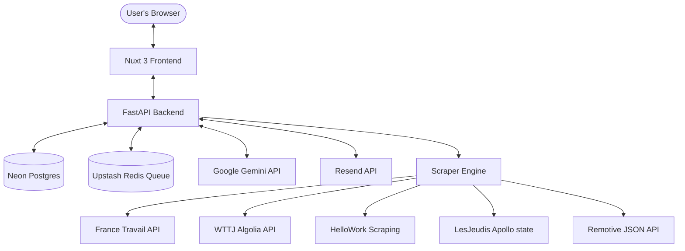
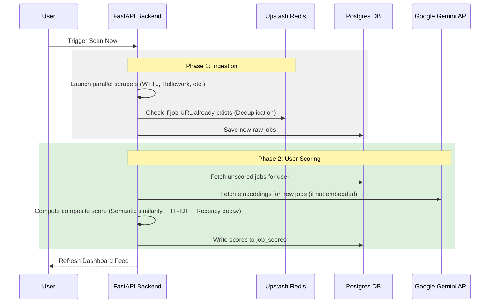

# System Architecture — JobRadar AI

This document provides a detailed breakdown of JobRadar AI's system architecture, execution flow, database relations, and components interaction.

---

## 1. High-Level Topology

JobRadar AI is designed as a self-hosted, decoupled multi-user application. It consists of:

1. **Frontend (Nuxt 3 SPA)**: Provides the dashboard interface, application pipeline (Kanban board), accomplishments vault, onboarding forms, and charts/analytics.
2. **Backend API (FastAPI)**: Handles user authentication, onboarding logic, resume ingestion, custom cover letter/CV generation, scoring queries, and manual/automated scraping actions.
3. **Database (Neon PostgreSQL)**: Stores relational data including user credentials, user profiles, matching criteria, scraped job listings, and individual composite scores.
4. **Deduplication & Queueing (Upstash Redis)**: Provides cache-based job URL deduplication and a light REST-based queueing structure.
5. **AI Services**:
   - **Google Gemini API** (`text-embedding-004`) for generating semantic vectors for job posts and candidate CVs.
   - **Google Gemini 1.5/2.0** models for generating tailored resumes and cover letters in Markdown.
6. **Notification (Resend)**: Handles sending transactional emails (such as high-match job alerts and password resets).

---

## 2. Scraping and Scoring Pipeline

JobRadar AI separates job ingestion from user-specific scoring to maximize efficiency and minimize API usage.

### Ingestion Flow
1. When a user triggers **Scan Now**, the backend identifies target search terms and locations configured across **all user profiles** to minimize scraper runs.
2. The scraping engine queries the external job boards.
3. Every found job link is validated against Upstash Redis. If the URL has been processed within the expiry period, it is skipped.
4. Unique jobs are written to the `jobs` table in Postgres.

### Scoring Flow
1. The backend runs a scoring pass for the requesting user's profile.
2. For each job description that hasn't been scored for the current user:
   - It retrieves/generates the description's vector embedding.
   - It retrieves/generates the user CV embedding.
   - It performs TF-IDF keyword overlap analysis.
   - It calculates the Recency decay based on the job posting date.
3. A composite score is saved in the `job_scores` table, linking the job to the user.

---

## 3. Tech Stack Deep-Dive

### Frontend (`/frontend`)
- **Nuxt 3 & Vue 3**: Utilizing modern Composition API, page-routing, and middleware.
- **Vanilla CSS**: Curated custom styling variables, grid layouts, glassmorphic card designs, and dark mode optimizations. No bulky CSS framework dependencies.
- **State Management**: Composables for user sessions, onboarding preferences, and client-side page updates.

### Backend (`/services/scorer`)
- **FastAPI**: Asynchronous routing built on `uvicorn`.
- **asyncpg**: High-performance PostgreSQL client utilizing native async query execution.
- **scikit-learn**: Used locally to compute TF-IDF matrices for keyword relevance matching.
- **Google GenAI SDK**: Integrates embedding models and text generation.
